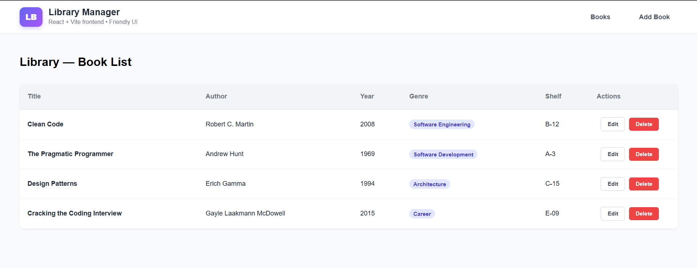

# 📚 Library Manager

A modern, full-stack web application for managing library book records. This project demonstrates a seamless integration between a **React (TypeScript)** frontend and a **Spring Boot** backend, featuring a polished, full-screen dashboard UI.
---

---

## 🚀 Tech Stack

### Frontend
- **Framework:** React + Vite
- **Language:** TypeScript
- **Styling:** CSS3 (Custom Glassmorphism & Dashboard Layout)
- **Routing:** React Router DOM
- **HTTP Client:** Axios

### Backend
- **Framework:** Spring Boot 3
- **Language:** Java 17+
- **Database:** H2 In-Memory Database (JPA/Hibernate)
- **Tools:** Maven, Lombok

## ✨ Features

- **Dashboard UI:** A centered, non-scrolling "floating card" layout with glassmorphism effects.
- **CRUD Operations:**
  - **Create:** Add new books with validation.
  - **Read:** View all books in a responsive table.
  - **Update:** Edit existing book details.
  - **Delete:** Remove books from the system.
- **Responsive Design:** Adapts to different screen sizes while maintaining the dashboard feel.

## 🛠️ Getting Started

### Prerequisites
- Node.js (v18+)
- Java JDK (17 or 21)
- Maven

### 1. Setup Backend
The backend runs on port `8080`.

```bash
cd library-backend
./mvnw spring-boot:run
```
### 2. Setup Frontend
#### The frontend runs on port 5173
```bash
cd library-frontend
npm install
npm run dev
```
## 🔌 API Endpoints
#### Method,Endpoint,Description
#### GET,/api/books,Fetch all books
#### GET,/api/books/{id},Fetch a single book
#### POST,/api/books,Add a new book
#### PUT,/api/books/{id},Update an existing book
#### DELETE,/api/books/{id},Delete a book
